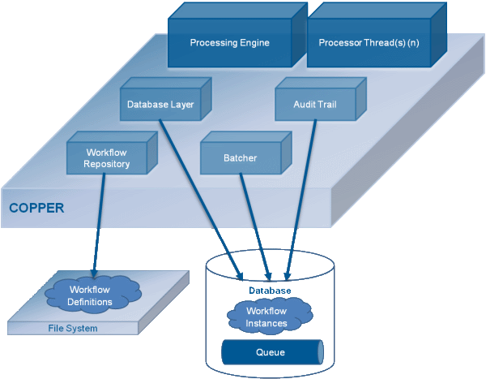

# Copper工作流引擎

[官网：http://copper-engine.org/](http://copper-engine.org/)

> Copper是一个开源，强大，轻量，且易用的工作流引擎，使用Java代码描述工作流。

## 强大 - 高效率的工作流引擎

- 自动故障恢复  
- 动态资源分配
- 热部署
- 版本控制
- 长期运行（一个月或以上）
- 高可用支持（Cassandra、Oracle）

## 基于Java语言实现

相比于其它Java语言实现的工作流引擎，Copper不仅100%使用Java编写，同时也是使用Java代码定义一个工作流。

此外，基于Class是可以动态加载的特性，你也可以动态修改工作流。

Copper运行在Java7或者Java8

## 开源 - Apache License 2.0

在[GitHub](https://github.com/copper-engine/copper-engine)上开放全部的源代码，以及提供丰富的文档说明

---

## 组件架构

### *Processing Engine 处理引擎*

- Copper的核心组件，用于执行工作流实例
- 单进程运行
- 有Transient（非持久）和Persistent（持久）两种工作流引擎

### *Workflow Repository 工作流仓库*

- 封装存储，和处理工作流的定义
- 从文件中读取工作流
- 热部署：观察文件是否有修改

### *Database Layer 数据库层*

- 将数据库与Copper解偶
- 封装访问Persistent工作流的方式
- 开放自定义存储，以扩展未被支持的数据库

### *Audit Trail 逐位跟踪*

- 实现了简单常用的逐位跟踪