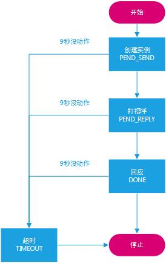

# Copper工作流引擎-HelloWorld

> Copper是一个开源，强大，轻量，且易用的工作流引擎，使用Java代码描述工作流。

[官网：http://copper-engine.org](http://copper-engine.org)

## 强大 - 高效率的工作流引擎

- 自动故障恢复  
- 动态资源分配
- 热部署
- 版本控制
- 长期运行（一个月或以上）
- 高可用支持（Cassandra、Oracle）

## 基于Java语言实现

相比于其它Java语言实现的工作流引擎，Copper不仅100%使用Java编写，同时也是使用Java代码定义一个工作流。

此外，基于Class是可以动态加载的特性，你也可以动态修改工作流。

Copper运行在Java7或者Java8

## 开源 - Apache License 2.0

在[GitHub](https://github.com/copper-engine/copper-engine)上开放全部的源代码，以及提供丰富的文档说明

---

## 组件架构


### *Processing Engine 处理引擎*

- Copper的核心组件，用于执行工作流实例
- 单进程运行
- 有Transient（非持久）和Persistent（持久）两种工作流引擎

### *Workflow Repository 工作流仓库*

- 封装存储，和处理工作流的定义
- 从文件中读取工作流
- 热部署：观察文件是否有修改

### *Database Layer 数据库层*

- 将数据库与Copper解偶
- 封装访问Persistent工作流的方式
- 开放自定义存储，以扩展未被支持的数据库

### *Audit Trail 逐位跟踪*

- 实现了简单常用的逐位跟踪

---
## Hello World 示例



### *创建工作流引擎ProcessingEngine*

```java
/**
 * 创建非持久工作流引擎
 * @param sourceDir 工作流源码存放的路径
 * @param targetDir 编译后存放的路径
 * @return
 */
public static TransientScottyEngine create(String sourceDir, String targetDir) {
    TransientScottyEngine engine = new TransientScottyEngine();
    engine.setIdFactory(createIdFactory());
    engine.setEngineIdProvider(createEngineIdProvider());
    engine.setDependencyInjector(createDependencyInjector());
    engine.setPoolManager(createProcessorPoolManager());
    engine.setTicketPoolManager(createTicketPoolManager());
    engine.setTimeoutManager(createTimeoutManager());
    engine.setStatisticsCollector(createRuntimeStatisticsCollector());
    engine.setEarlyResponseContainer(createEarlyResponseContainer());
    engine.setWfRepository(createWorkflowRepository(sourceDir, targetDir));
    return engine;
}
```

 - `TransientScottyEngine`继承于`ProcessingEngine`，是一个非持久工作流引擎
 - `WorkflowRepository`工作流库存，需要指定源码和编译后的文件存放路径
 - `PojoDependencyInjector`实体依赖注入器，注册工作流定义中要注入的对象

### *定义工作流Workflow*
 
 ```java
@WorkflowDescription(alias = WorkflowDef.HELLO_WORLD, majorVersion = 1, minorVersion = 0, patchLevelVersion = 0)
public class HelloWorldWorkflow extends Workflow<HelloWorldData> {

    @Override
    public void main() throws Interrupt {
    }

}
```

- 所有非持久工作流都必须继承`Workflow`，并重写`main`方法
- `HelloWorldData`必须实现`Serializable`接口，用于工作流内外部的交流

### *依赖注入*

```java
private transient HelloWorldAdapter helloWorldAdapter;

@AutoWire
public void setHelloWorldAdapter(HelloWorldAdapter helloWorldAdapter) {
    this.helloWorldAdapter = helloWorldAdapter;
}
```

- 内外部之间的访问，一般使用Adapter适配
- 内部可以使用外部对象，但是必须在`PojoDependencyInjector`中注册
- `transient`关键字表示不对此对象进行序列化存储

### *创建工作流实例*

```java
public void runWorkflow(HelloWorldData data) {
    try {
        engine.run(WorkflowDef.HELLO_WORLD, data);
    } catch (Exception e) {
        throw new RuntimeException(e);
    }
}
```

### *工作流的等待*

工作流的执行过程中，如果我们想暂时停下来等待，我们可以在工作流内部执行：

```java
wait(WaitMode.ALL, 9 * 1000, cid);
response = getAndRemoveResponse(cid);
```

- `9 * 1000`等待时间9秒，如果超时未唤醒，将自动往下执行。0表示永久等待
- `cid`等待时的标识，唤醒时将会用到

### *工作流的唤醒*

```java
Response<HelloWorldData> response = new Response<>(data.getCid(), data, null);
Acknowledge.DefaultAcknowledge ack = new Acknowledge.DefaultAcknowledge();
engine.notify(response, ack);
ack.waitForAcknowledge();
```

---

## HelloWorldWorkflowTests测试

为方便演示工作流，案例使用`Scanner`从控制台获取文本，从而执行相应的操作

```java
logger.info("usage: list | run | send CID NAME | reply CID NAME");
Scanner sc = new Scanner(System.in);
while (true) {
    System.out.println("please input ：");
    String input = sc.nextLine();
    String[] strs = input.split("\\s");
    if ("list".equals(strs[0])) {
        List<HelloWorldData> datas = adapter.listData();
        for (HelloWorldData data : datas) {
            logger.info(String.format("Workflow %s: cid=%s, status=%s, sender=%s, replier=%s", WorkflowDef.HELLO_WORLD, data.getCid(), data.getStatus(), data.getSender(), data.getReplier()));
        }
    } else if ("run".equals(strs[0])) {
        HelloWorldData data = new HelloWorldData();
        adapter.runWorkflow(data);
    } else if ("send".equals(strs[0]) && strs.length >= 3) {
        adapter.sendHelloWorld(strs[1], strs[2]);
    } else if ("reply".equals(strs[0]) && strs.length >= 3) {
        adapter.replyHelloWorld(strs[1], strs[2]);
    }
}
```

- list：查看所有的工作流实例
- run：创建一个工作流实例
- send CID NAME：打招呼
- reply CID NAME：回应

```text
[INFO] 2017-03-07 14:03:38 usage: list | run | send CID NAME | reply CID NAME
please input ：
run
[INFO] 2017-03-07 14:04:00 Mapping workflow class 'com.example.workflow.HelloWorldWorkflow' to ticket pool DEFAULT
please input ：
[INFO] 2017-03-07 14:04:00 Init Workflow HELLO_WORLD: cid=1, status=PEND_SEND
send 1 lily
please input ：
[INFO] 2017-03-07 14:04:06 com.example.workflow.HelloWorldWorkflow$1 created
[INFO] 2017-03-07 14:04:06 Send Workflow HELLO_WORLD: cid=1, status=PEND_REPLY, sender=lily
reply 1 lucy
please input ：
[INFO] 2017-03-07 14:04:12 Reply Workflow HELLO_WORLD: cid=1, status=DONE, sender=lily, replier=lucy
list
[INFO] 2017-03-07 14:04:15 Workflow HELLO_WORLD: cid=1, status=DONE, sender=lily, replier=lucy
```

*PS：本文使用的是copper-4.2.0*